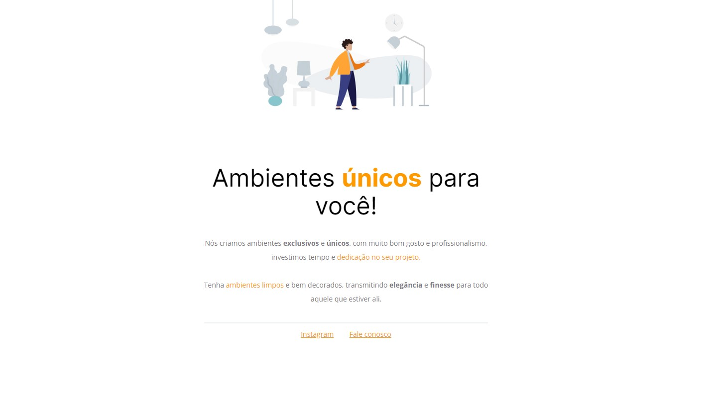

# Desafio 1 - Móveis costumizados ✅

* <a href="https://lucyanovidio.github.io/rocketseat-explorer/nivel-02/stage/desafio-01/">Acesse aqui.</a>

## 💻 O desafio

Móveis costumizados é uma página web simples para uma empresa fictícia de venda de móveis. Nesse projeto aprendi um pouco sobre:
* Introdução ao HTML5: tags, atributos e etc;
* Introdução ao CSS3: seletores e propriedades;
* Figma básico;
* Box Model;
* Dev Tools;
* Uso do <a href="https://fonts.google.com">Google Fonts</a>;
* Utilizar o <a href="https://codepen.io">Codepen</a> e o Github para enviar projetos.

## 🎨 Layout do projeto

Este é o <a href="https://www.figma.com/file/dZwREQYzGOFsCjEoObp5Mx/Explorer---Projeto-01-(Copy)?node-id=0%3A1&t=sMfD75Hlfo1V8SKh-0">layout do projeto</a> no Figma.

## 🛠 Tecnologias

    
    

 

 

---

<table>
  <tr>
    <td>
      
    </td>
    <td>
      
    </td>
    <td>
      Feito por <a href="https://github.com/lucyanovidio">Lucyan Ovídio</a> 🙋🏿‍♂️
        Junto com <a href="https://rocketseat.com.br">Rocketseat</a> 🚀.
    </td>
  </tr>
</table>
