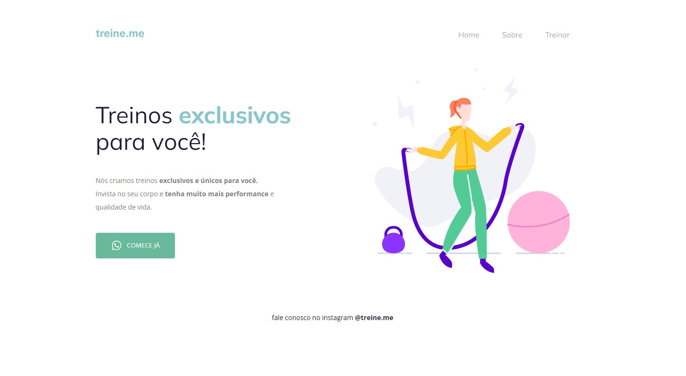

# Desafio 2 - Treine.me ✅

* <a href="https://lucyanovidio.github.io/rocketseat-explorer/nivel-02/stage/desafio-02/">Acesse aqui.</a>

## 💻 O desafio

Treine.me é uma página web simples para uma empresa fictícia de treinos e instrução de exercícios físicos. Nesse projeto aprendi um pouco sobre:
* Semântica HTML;
* Diferentes propriedades de *position* no CSS;
* *Inline* vs *Block*.
* Flexbox;
* *Linear-gradient*.

## 🎨 Layout do projeto

Este é o <a href="https://www.figma.com/file/rkDOHGPwwFtBNqEdHSuQPd/Projeto-02---Explorer?node-id=0%3A1">layout do projeto</a> no Figma.

## 🛠 Tecnologias

    
    

 

 

---

<table>
  <tr>
    <td>
      
    </td>
    <td>
      Feito por <a href="https://github.com/lucyanovidio">Lucyan Ovídio.</a> 🙋🏿‍♂️
    </td>
  </tr>
</table>
