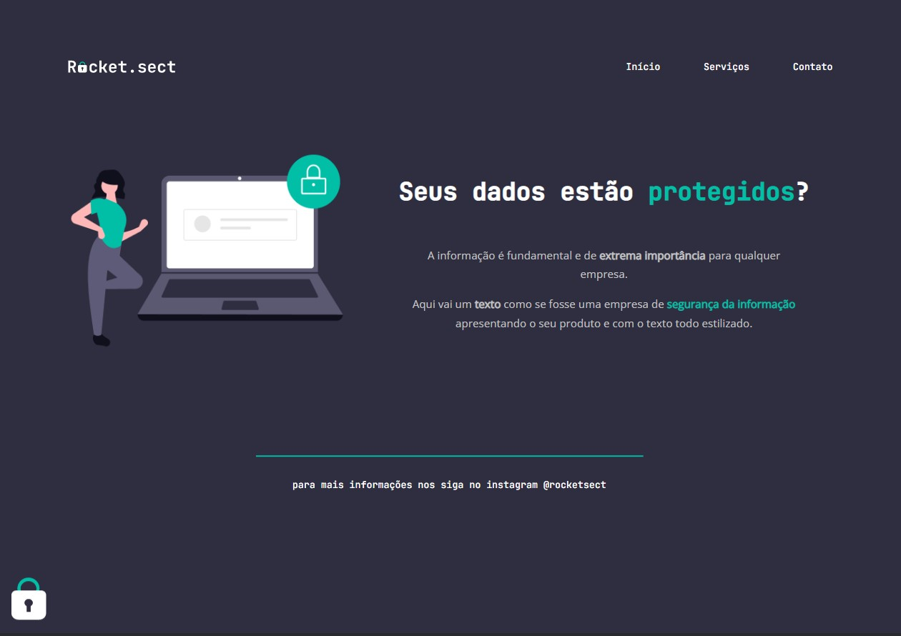

# Desafio 4 - Rocket.sect ✅

* <a href="https://lucyanovidio.github.io/rocketseat-explorer/nivel-02/stage/desafio-04/">Acesse aqui.</a>

## 💻 O desafio

Rocket.sect é uma página web simples para uma empresa fictícia de segurança da informação. Nesse projeto aprendi mais sobre:
* Acessibilidade;
* Estilização com cores e fontes.

## 🎨 Layout do projeto

Este é o <a href="https://www.figma.com/file/EdKjPWjC8ZlbnH4XzTObv2/Explorer/duplicate">layout do projeto</a> no Figma.

## 🛠 Tecnologias

    
    

 

 

---

<table>
  <tr>
    <td>
      
    </td>
    <td>
      Feito por <a href="https://github.com/lucyanovidio">Lucyan Ovídio.</a> 🙋🏿‍♂️
    </td>
  </tr>
</table>
