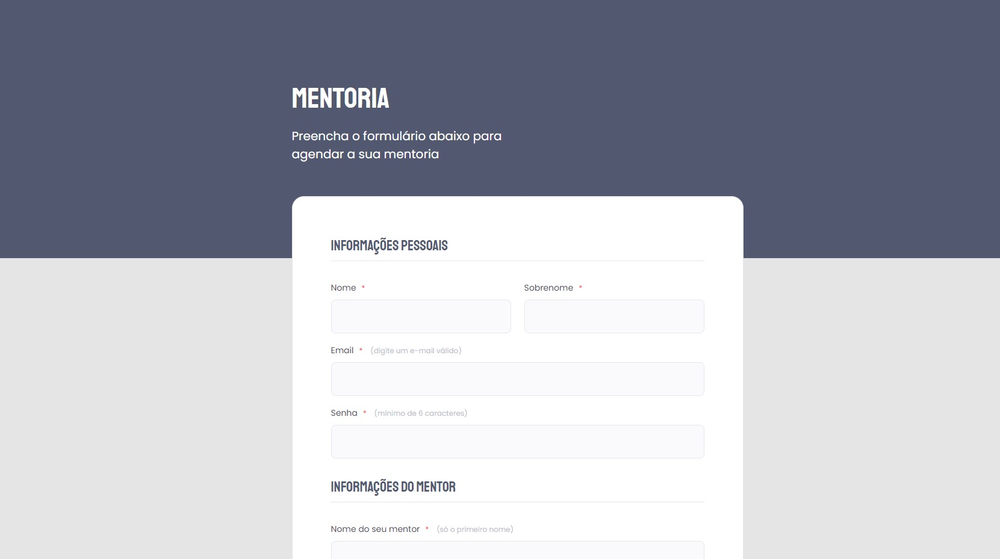

# Desafio 1 - Formulário de mentoria ✅

* <a href="https://lucyanovidio.github.io/rocketseat-explorer/nivel-03/stage/desafio-01/">Acesse aqui.</a>

## 💻 O desafio

Formulário de mentoria é uma página web de formulário para inscrição fictícia em uma mentoria. Nesse projeto aprendi um pouco sobre:
* Formulários e tags no HTML;
* Validação de campos no HTML e submetendo formulários;
* Estilização de inputs.

## 🎨 Layout do projeto

Este é o <a href="https://www.figma.com/file/sgcJKpGAeVqh7rf2pwsOd9/Explorer-Stage-03-Projeto-01/duplicate">layout do projeto</a> no Figma.

## 🛠 Tecnologias

    
    

 

 

---

<table>
  <tr>
    <td>
      
    </td>
    <td>
      Feito por <a href="https://github.com/lucyanovidio">Lucyan Ovídio.</a> 🙋🏿‍♂️
    </td>
  </tr>
</table>
