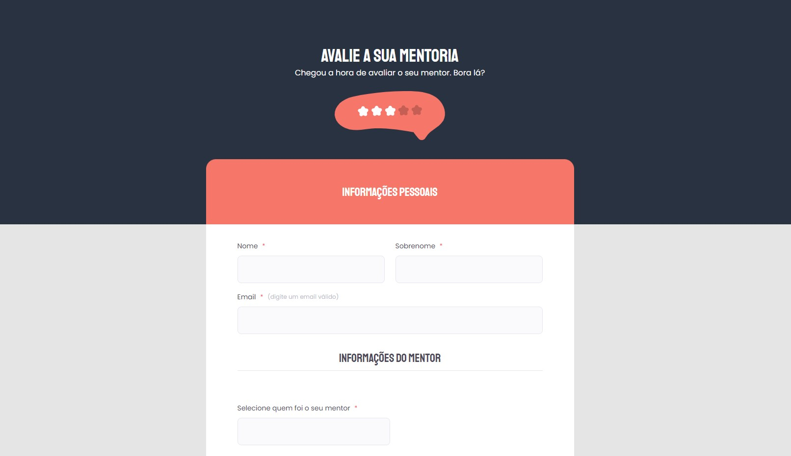

# Desafio 2 - Formulário de avaliação de mentoria ✅

* <a href="https://lucyanovidio.github.io/rocketseat-explorer/nivel-03/stage/desafio-02/">Acesse aqui.</a>

## 💻 O desafio

Formulário de avaliação de mentoria é um formulário fictício para avaliação de uma mentoria. Pratiquei nele o que aprendi anteriormente.

## 🎨 Layout do projeto

Este é o <a href="https://www.figma.com/file/fnZyJHs7eqNFAA7tUrKcsD/Stage-03---Formul%C3%A1rio-avan%C3%A7ado/duplicate">layout do projeto</a> no Figma.

## 🛠 Tecnologias

    
    

 

 

---

<table>
  <tr>
    <td>
      
    </td>
    <td>
      Feito por <a href="https://github.com/lucyanovidio">Lucyan Ovídio.</a> 🙋🏿‍♂️
    </td>
  </tr>
</table>
