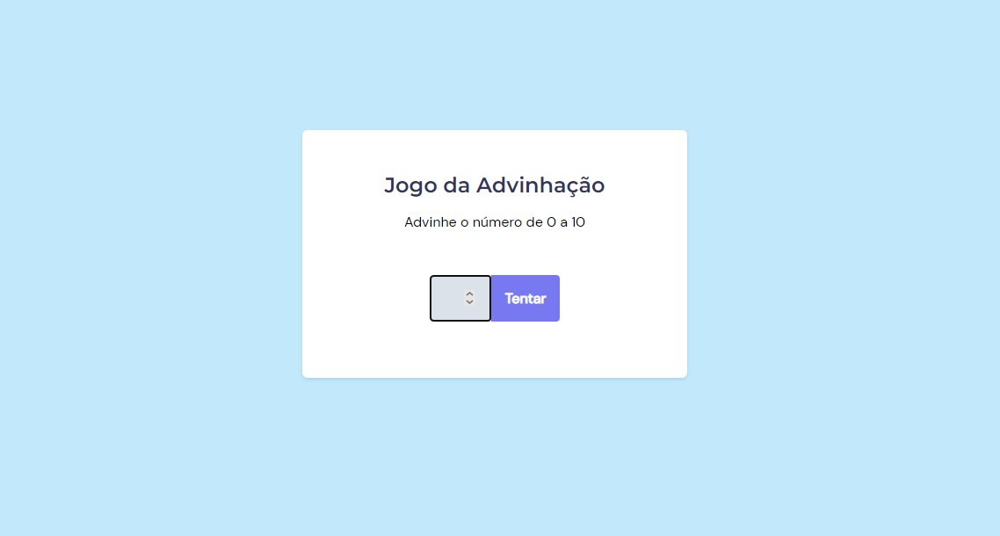

# Desafio 1 - Jogo da adivinhação ✅

* <a href="https://lucyanovidio.github.io/rocketseat-explorer/nivel-05/stage/desafio-01/">Acesse aqui.</a>

## 💻 O desafio

O Jogo da adivinhação é uma página web com um programa que sorteia um número de 0 a 10 e mostra uma mensagem caso o usuário acerte o número. Nesse projeto aprendi um pouco sobre:
* Manipulação da DOM;
* Eventos e callbacks;
* Biblioteca JS Math();
* Básico de refatoração.

## 🎨 Layout do projeto

Este é o <a href="https://www.figma.com/file/5pZNHokTKTvld18xVAbk5C/Jogo-Adivinha%C3%A7%C3%A3o/duplicate">layout do projeto</a> no Figma.

## 🛠 Tecnologias

    
    
    

 

 

---

<table>
  <tr>
    <td>
      
    </td>
    <td>
      Feito por <a href="https://github.com/lucyanovidio">Lucyan Ovídio.</a> 🙋🏿‍♂️
    </td>
  </tr>
</table>
