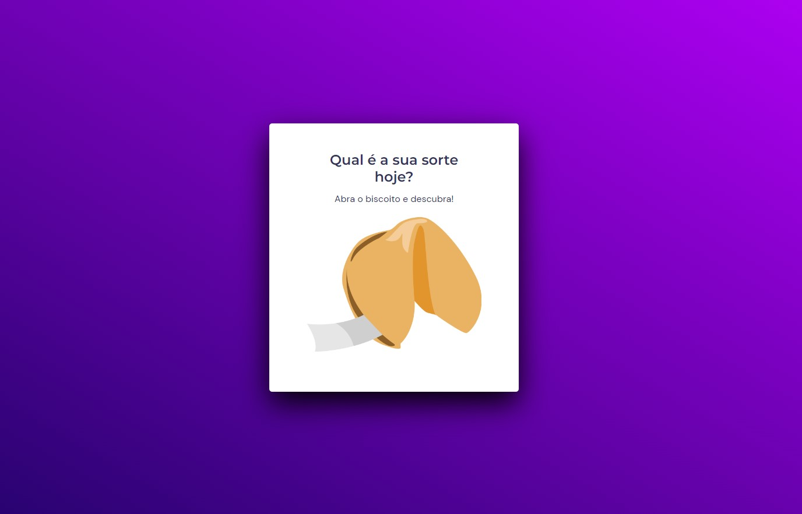

# Desafio 2 - Biscoito da sorte ✅

* <a href="https://lucyanovidio.github.io/rocketseat-explorer/nivel-05/stage/desafio-02/">Acesse aqui.</a>

## 💻 O desafio

O Biscoito da sorte é um programa em uma página web que sorteia uma frase (a sua sorte) entre um conjunto de várias e mostra na tela com uma animação de biscoito sendo quebrado. Nesse projeto apliquei o que aprendi no <a href="https://github.com/lucyanovidio/rocketseat-explorer/tree/main/nivel-05/stage/desafio-01">Jogo da adivinhação</a> e aprendi um pouco mais sobre:
* DOM;
* Arrays, Funções e eventos;
* Biblioteca JS Math();
* Animações CSS e responsividade.

## 🎨 Layout do projeto

Este é o <a href="https://www.figma.com/community/file/1182751789348533739">layout do projeto</a> no Figma.

## 🛠 Tecnologias

    
    
    

 

 

---

<table>
  <tr>
    <td>
      
    </td>
    <td>
      Feito por <a href="https://github.com/lucyanovidio">Lucyan Ovídio.</a> 🙋🏿‍♂️
    </td>
  </tr>
</table>
