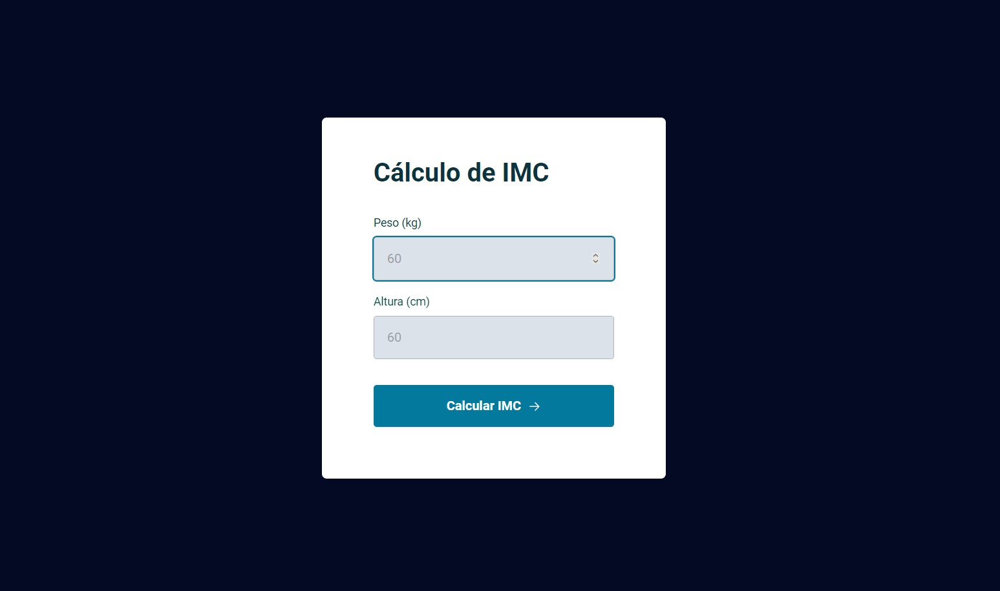

# Desafio 3 - Calculadora de IMC ✅

* <a href="https://lucyanovidio.github.io/rocketseat-explorer/nivel-05/stage/desafio-03/">Acesse aqui.</a>

## 💻 O desafio

A Calculadora de IMC calcula com base no peso e altura fornecidos. Covertendo a altura de *cm* para *m*, calculamos mostrando um resultado final em decimal com duas casas pós vírgula. Nesse projeto aprendi muito sobre:
* Objetos literais;
* ES Modules - import e export;
* Semântica em JavaScript;
* Boas práticas;
* Refatoração.

Além do que é feito em aula, apliquei algumas outras ideias ao projeto:
* Classificação a partir do IMC;
* Uso de classes utilitárias para CSS;
* Fechar modal com clique no backdrop;
* Limpeza de campos;
* Melhoria de semântica.

## 🎨 Layout do projeto

Este é o <a href="https://www.figma.com/file/ABhdeUBoc26CrOUefxU4lx/IMC-(Copy)?node-id=6%3A5&t=UX9TZGuUZQGGnZN5-0">layout do projeto</a> no Figma.

## 🛠 Tecnologias

    
    
    

 

 

---

<table>
  <tr>
    <td>
      
    </td>
    <td>
      
    </td>
    <td>
      Feito por <a href="https://github.com/lucyanovidio">Lucyan Ovídio</a> 🙋🏿‍♂️
        Junto com <a href="https://rocketseat.com.br">Rocketseat</a> 🚀.
    </td>
  </tr>
</table>