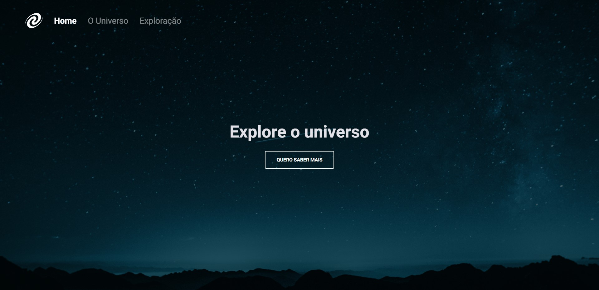

# Desafio 2 - SPA Universe ✅



* <a href="https://lucyanovidio.github.io/rocketseat-explorer/nivel-06/stage/desafio-02/">Acesse aqui.</a>

## 💻 O desafio

A SPA Universe é uma página web no modelo Single Page Application. A propósta do seu desenvolvimento é praticar conhecimentos que serão necessários quando vermos o uso de bibliotecas e frameworks, como React. Nesse projeto apliquei os seguintes conceitos:
* Conceitos de SPA
* Mapeamento de rotas
* Assincronismo e promises com *fetch*
* Orientação a objetos com uso de classes e mais
* Eventos JavaScript

## ⚡ Como rodar

Para rodar o projeto direto da sua máquina:
- Baixe o repositório, ou clone com a URL disponível aqui, com o comando
```
git clone https://github.com/lucyanovidio/rocketseat-explorer.git
```
- Foi usado o servidor *Lite-server* para executar o projeto no navegador. Para utilizá-lo, instale o <a href="https://nodejs.org/">Node.js</a>.
- Entre no diretório deste projeto e instale as dependências executando:
```
npm install
```
- Inicie o servidor:
```
npm start
```

## 🎨 Layout do projeto

Este é o <a href="https://www.figma.com/file/m8zp3mtxvwyTGQs69nIFM8/%5BDesafios-Explorer%5D-SPA-Universe/duplicate">layout do projeto</a> no Figma.

## 🛠 Tecnologias

<div>
    
    
    
</div>
<br>

<br>

---

<table>
  <tr>
    <td>
      
    </td>
    <td>
      Feito por <a href="https://github.com/lucyanovidio">Lucyan Ovídio.</a> 🙋🏿‍♂️
    </td>
  </tr>
</table>
